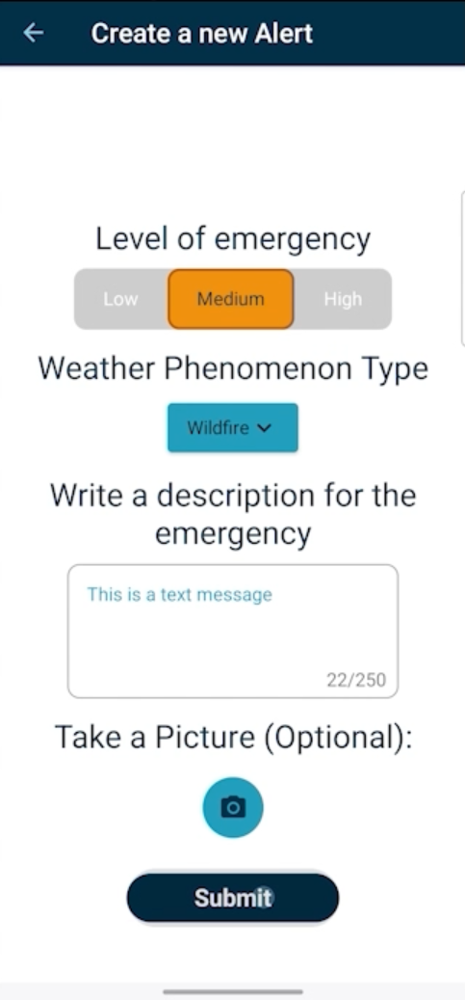
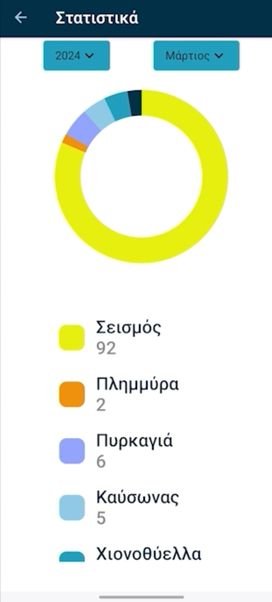

# Current Topics of Software Engineering (2024) - Smart Alert Android App

## Project Overview

The **Smart Alert Android App** is a team assignment designed for the "Current Topics of Software Engineering - Mobile Software" course, offered in the 7th semester of the 2023-2024 academic year at the University of Piraeus, Department of Informatics. The app provides real-time notifications to citizens during high-risk events such as natural disasters. It allows users to report emergencies, receive location-based alerts, and stay informed about ongoing hazardous situations. The app enables users to manage their safety by accessing vital information about their surroundings.

The Smart Alert system integrates with [Smart Alert Backend](https://github.com/thkox/current-topics-of-software-engineering_2023-smart-alert-server) that processes user-submitted reports, ranks them based on severity and proximity, and sends notifications to users in affected areas. This backend infrastructure ensures that only relevant alerts are delivered to those at risk.

## Course Information

- **Institution:** University of Piraeus
- **Department:** Department of Informatics
- **Course:** Current Topics of Software Engineering (2024)
- **Semester:** 7th

## Technologies Used

- Kotlin
- Jetpack Compose
- Firebase Cloud Messaging (FCM)
- Firebase Authentication
- Firebase Realtime Database
- Firebase Cloud Storage
- SQLite

## App Features

### 1. User Roles

- **Citizen:** Users can report high-risk incidents by providing details such as the type of event (e.g., flood, fire), location, timestamp, and optionally attaching a photo.
- **Employee (Civil Protection):** Employees review, approve, or reject the reported incidents. They can also trigger notifications for citizens in affected areas.

### 2. Incident Reporting and Notification

- **Emergency Reporting:** Citizens can report emergencies categorized into pre-defined event types (floods, fires, earthquakes, etc.).
- **Location-Based Notifications:** Notifications are sent automatically to users in close proximity to the reported event, with information such as location, timestamp, and safety instructions.

### 3. Multilingual Support

- The app supports English and one additional language, allowing users to receive critical information in their preferred language.

### 4. Statistics and Event History

- **View Statistics:** Users can view statistics about past incidents, filterable by time and category, through a dedicated statistics interface.
- **Event History:** Users can access a history of reported incidents to stay informed about ongoing and past events in their area.

## Setup Instructions

1. Clone the repository:
    ```bash
    git clone https://github.com/thkox/current-topics-of-software-engineering_2023-smart-alert.git
    ```

2. Open the project in Android Studio.
3. Configure Firebase credentials by adding the necessary `google-services.json` file.
4. Build and run the app on an Android device or emulator.

## Documentation and Resources

- Full project details can be found in the [Project-documentation.pdf](./docs/Project-documentation.pdf).
- A detailed walkthrough video is available: [Project-video.mp4](./video/Project-video.mp4).

## Screenshots

<table>
  <tr>
    <td align="center">
      
      <br/>
      <sub><b>Report Incident</b></sub>
    </td>
    <td align="center">
      
      <br/>
      <sub><b>Notifications</b></sub>
    </td>
    <td align="center">
      
      <br/>
      <sub><b>Statistics</b></sub>
    </td>
  </tr>
</table>

## Contributors

<table>
  <tr>
    <td align="center"><a href="https://github.com/ApostolisSiampanis"><br /><sub><b>Apostolis Siampanis</b></sub></a><br /></td>
    <td align="center"><a href="https://github.com/thkox"><br /><sub><b>Theodore Koxanoglou</b></sub></a><br /></td>
    <td align="center"><a href="https://github.com/AlexanderCholis"><br /><sub><b>Alexander Cholis</b></sub></a><br /></td>
  </tr>
</table>

## License

This project is licensed under the MIT License - see the [LICENSE](./LICENSE) file for details.
